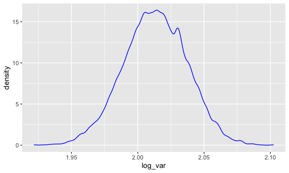

Homework 6
================
Caroline Andy
12/6/2020

### Problem 1

``` r
library(purrr)
library(tidyverse)
library(stringr)
library(patchwork)
library(skimr)
library(modelr)

knitr::opts_chunk$set(
  fig.width = 6,
  fig.asp = .6,
  out.width = "90%"
)
```

For this problem, I will use a dataset containing reported homicides in
50 large U.S. cities. I will first clean the data, creating a city-state
variable, revaluing disposition, and removing cities that do not report
homicide race data.

``` r
#generate homicide table and summarize solved and unsolved murders by state
homicide = 
  read_csv("homicide-data.csv", na = c("", "NA", "Unknown")) %>%
  drop_na() %>%
  mutate(
    city_state = str_c(city, state, sep = ", "),
    victim_age = as.numeric(victim_age),
    victim_sex = as.factor(victim_sex),
    resolution = case_when(
      disposition %in% "Closed without arrest" ~ 0,
      disposition %in% "Closed by arrest" ~ 1, 
      disposition %in% "Open/No arrest" ~ 0)) %>%
  filter(
    victim_race %in% c("White", "Black"),
    !(city_state %in% c("Tulsa, AL", "Dallas, TX", "Phoenix, AZ", "Kansas City, MO"))) %>%
  mutate(
    victim_race = as.factor(victim_race),
    victim_race = as.character(victim_race),
    victim_sex = as.character(victim_sex)
  ) %>%
  select(city_state, resolution, victim_age, victim_race, victim_sex)
```

Now I will use the glm function to fit a logistic regression with
resolved vs unresolved as the outcome and victim age, sex and race as
predictors for the city of Baltimore, MD,

``` r
baltimore_df = 
  homicide %>%
  filter(city_state == "Baltimore, MD")

glm(resolution ~ victim_age + victim_race + victim_sex, 
    data = baltimore_df, 
    family = binomial()) %>%
  broom::tidy() %>%
  mutate(
    OR = exp(estimate),
    CI_lower = exp(estimate - 1.96 * std.error),
    CI_upper = exp(estimate + 1.96 * std.error)
  ) %>%
  select(term, OR, starts_with("CI")) %>%
  knitr::kable(digits = 3)
```

| term              |    OR | CI\_lower | CI\_upper |
| :---------------- | ----: | --------: | --------: |
| (Intercept)       | 1.363 |     0.975 |     1.907 |
| victim\_age       | 0.993 |     0.987 |     1.000 |
| victim\_raceWhite | 2.320 |     1.648 |     3.268 |
| victim\_sexMale   | 0.426 |     0.325 |     0.558 |

Now I will run glm for each of the cities in my dataset, and extract the
adjusted odds ratio and confidence interval (CI) for solving homicides
comparing Black victims to White victims.

``` r
model_results_df = 
  homicide %>%
  nest(data = -city_state) %>%
  mutate(
    models = 
      map(.x = data, ~glm(resolution ~ victim_age + victim_sex + victim_race, data = .x, family = binomial())),
    results = map(models, broom::tidy)
) %>%
  select(city_state, results) %>%
  unnest(results) %>%
  mutate(
    OR = exp(estimate),
    CI_lower = exp(estimate - 1.96 * std.error),
    CI_upper = exp(estimate + 1.96 * std.error)
  ) %>%
  select(city_state, term, OR, starts_with("CI"))
```

The below plot shows the estimated odds ratios and CIs for White race
(as compared to Black race as the reference category) for each city.

``` r
model_results_df %>%
  filter(term == "victim_raceWhite") %>%
  mutate(city_state = fct_reorder(city_state, OR)) %>%
  ggplot(aes(x = city_state, y = OR)) +
  geom_point() +
  geom_errorbar(aes(ymin = CI_lower, ymax = CI_upper)) +
  theme(axis.text.x = element_text(angle = 90, hjust = 1))
```


Overall, these results show that White race is associated with 2.320
times the odds of having a resolved homicide as compared to Black race.
In particular, this disparity is the largest in Boston, MA, where white
race is associated with over 10 times the odds of having a resolved
homicide as compared to Black race. This disparity is the lowest in
Tampa, Florida.

### Problem 2

In this problem, I will analyze data gathered to understand the effects
of several variables on a child’s birthweight. This dataset consists of
roughly 4000 children and includes 20 variables, including baby sex,
head circumference, length, gestational age, and mother’s age, age at
menarche, height, race and previous pregnancy outcomes.

Here I will load and clean the data for regression analysis, converting
numeric variables to factor variables where appropriate, and checking
for missing values.

``` r
bweight = read_csv("./birthweight.csv")
skim(bweight) 
```

|                                                  |         |
| :----------------------------------------------- | :------ |
| Name                                             | bweight |
| Number of rows                                   | 4342    |
| Number of columns                                | 20      |
| \_\_\_\_\_\_\_\_\_\_\_\_\_\_\_\_\_\_\_\_\_\_\_   |         |
| Column type frequency:                           |         |
| numeric                                          | 20      |
| \_\_\_\_\_\_\_\_\_\_\_\_\_\_\_\_\_\_\_\_\_\_\_\_ |         |
| Group variables                                  | None    |

Data summary

**Variable type: numeric**

| skim\_variable | n\_missing | complete\_rate |    mean |     sd |      p0 |     p25 |     p50 |     p75 |   p100 | hist  |
| :------------- | ---------: | -------------: | ------: | -----: | ------: | ------: | ------: | ------: | -----: | :---- |
| babysex        |          0 |              1 |    1.49 |   0.50 |    1.00 |    1.00 |    1.00 |    2.00 |    2.0 | ▇▁▁▁▇ |
| bhead          |          0 |              1 |   33.65 |   1.62 |   21.00 |   33.00 |   34.00 |   35.00 |   41.0 | ▁▁▆▇▁ |
| blength        |          0 |              1 |   49.75 |   2.72 |   20.00 |   48.00 |   50.00 |   51.00 |   63.0 | ▁▁▁▇▁ |
| bwt            |          0 |              1 | 3114.40 | 512.15 |  595.00 | 2807.00 | 3132.50 | 3459.00 | 4791.0 | ▁▁▇▇▁ |
| delwt          |          0 |              1 |  145.57 |  22.21 |   86.00 |  131.00 |  143.00 |  157.00 |  334.0 | ▅▇▁▁▁ |
| fincome        |          0 |              1 |   44.11 |  25.98 |    0.00 |   25.00 |   35.00 |   65.00 |   96.0 | ▃▇▅▂▃ |
| frace          |          0 |              1 |    1.66 |   0.85 |    1.00 |    1.00 |    2.00 |    2.00 |    8.0 | ▇▁▁▁▁ |
| gaweeks        |          0 |              1 |   39.43 |   3.15 |   17.70 |   38.30 |   39.90 |   41.10 |   51.3 | ▁▁▂▇▁ |
| malform        |          0 |              1 |    0.00 |   0.06 |    0.00 |    0.00 |    0.00 |    0.00 |    1.0 | ▇▁▁▁▁ |
| menarche       |          0 |              1 |   12.51 |   1.48 |    0.00 |   12.00 |   12.00 |   13.00 |   19.0 | ▁▁▂▇▁ |
| mheight        |          0 |              1 |   63.49 |   2.66 |   48.00 |   62.00 |   63.00 |   65.00 |   77.0 | ▁▁▇▂▁ |
| momage         |          0 |              1 |   20.30 |   3.88 |   12.00 |   18.00 |   20.00 |   22.00 |   44.0 | ▅▇▂▁▁ |
| mrace          |          0 |              1 |    1.63 |   0.77 |    1.00 |    1.00 |    2.00 |    2.00 |    4.0 | ▇▇▁▁▁ |
| parity         |          0 |              1 |    0.00 |   0.10 |    0.00 |    0.00 |    0.00 |    0.00 |    6.0 | ▇▁▁▁▁ |
| pnumlbw        |          0 |              1 |    0.00 |   0.00 |    0.00 |    0.00 |    0.00 |    0.00 |    0.0 | ▁▁▇▁▁ |
| pnumsga        |          0 |              1 |    0.00 |   0.00 |    0.00 |    0.00 |    0.00 |    0.00 |    0.0 | ▁▁▇▁▁ |
| ppbmi          |          0 |              1 |   21.57 |   3.18 |   13.07 |   19.53 |   21.03 |   22.91 |   46.1 | ▃▇▁▁▁ |
| ppwt           |          0 |              1 |  123.49 |  20.16 |   70.00 |  110.00 |  120.00 |  134.00 |  287.0 | ▅▇▁▁▁ |
| smoken         |          0 |              1 |    4.15 |   7.41 |    0.00 |    0.00 |    0.00 |    5.00 |   60.0 | ▇▁▁▁▁ |
| wtgain         |          0 |              1 |   22.08 |  10.94 | \-46.00 |   15.00 |   22.00 |   28.00 |   89.0 | ▁▁▇▁▁ |

``` r
# no missing values, all variables are numeric

# convert sex, race and malformation variable to factors
bweight = bweight %>%
  mutate(babysex = (fct_infreq(as.factor(babysex))),
         frace = (fct_infreq(as.factor(frace))),
         mrace = (fct_infreq(as.factor(mrace))),
         malform = (fct_infreq(as.factor(malform)))) 
```

Now I will propose a regression model for birthweight using backwards
stepwise selection with the step() function.

``` r
## function for backward stepwise selection
mult.fit <- lm(bwt ~ ., data = bweight)
step(mult.fit, direction = 'backward')
```

    ## Start:  AIC=48717.83
    ## bwt ~ babysex + bhead + blength + delwt + fincome + frace + gaweeks + 
    ##     malform + menarche + mheight + momage + mrace + parity + 
    ##     pnumlbw + pnumsga + ppbmi + ppwt + smoken + wtgain
    ## 
    ## 
    ## Step:  AIC=48717.83
    ## bwt ~ babysex + bhead + blength + delwt + fincome + frace + gaweeks + 
    ##     malform + menarche + mheight + momage + mrace + parity + 
    ##     pnumlbw + pnumsga + ppbmi + ppwt + smoken
    ## 
    ## 
    ## Step:  AIC=48717.83
    ## bwt ~ babysex + bhead + blength + delwt + fincome + frace + gaweeks + 
    ##     malform + menarche + mheight + momage + mrace + parity + 
    ##     pnumlbw + ppbmi + ppwt + smoken
    ## 
    ## 
    ## Step:  AIC=48717.83
    ## bwt ~ babysex + bhead + blength + delwt + fincome + frace + gaweeks + 
    ##     malform + menarche + mheight + momage + mrace + parity + 
    ##     ppbmi + ppwt + smoken
    ## 
    ##            Df Sum of Sq       RSS   AIC
    ## - frace     4    124365 320848704 48712
    ## - malform   1      1419 320725757 48716
    ## - ppbmi     1      6346 320730684 48716
    ## - momage    1     28661 320752999 48716
    ## - mheight   1     66886 320791224 48717
    ## - menarche  1    111679 320836018 48717
    ## - ppwt      1    131132 320855470 48718
    ## <none>                  320724338 48718
    ## - fincome   1    193454 320917792 48718
    ## - parity    1    413584 321137922 48721
    ## - mrace     3    868321 321592659 48724
    ## - babysex   1    853796 321578134 48727
    ## - gaweeks   1   4611823 325336161 48778
    ## - smoken    1   5076393 325800732 48784
    ## - delwt     1   8008891 328733230 48823
    ## - blength   1 102050296 422774634 49915
    ## - bhead     1 106535716 427260054 49961
    ## 
    ## Step:  AIC=48711.51
    ## bwt ~ babysex + bhead + blength + delwt + fincome + gaweeks + 
    ##     malform + menarche + mheight + momage + mrace + parity + 
    ##     ppbmi + ppwt + smoken
    ## 
    ##            Df Sum of Sq       RSS   AIC
    ## - malform   1      1447 320850151 48710
    ## - ppbmi     1      6975 320855679 48710
    ## - momage    1     28379 320877083 48710
    ## - mheight   1     69502 320918206 48710
    ## - menarche  1    115708 320964411 48711
    ## - ppwt      1    133961 320982665 48711
    ## <none>                  320848704 48712
    ## - fincome   1    194405 321043108 48712
    ## - parity    1    414687 321263390 48715
    ## - babysex   1    852133 321700837 48721
    ## - gaweeks   1   4625208 325473911 48772
    ## - smoken    1   5036389 325885093 48777
    ## - delwt     1   8013099 328861802 48817
    ## - mrace     3  13540415 334389119 48885
    ## - blength   1 101995688 422844392 49908
    ## - bhead     1 106662962 427511666 49956
    ## 
    ## Step:  AIC=48709.53
    ## bwt ~ babysex + bhead + blength + delwt + fincome + gaweeks + 
    ##     menarche + mheight + momage + mrace + parity + ppbmi + ppwt + 
    ##     smoken
    ## 
    ##            Df Sum of Sq       RSS   AIC
    ## - ppbmi     1      6928 320857079 48708
    ## - momage    1     28660 320878811 48708
    ## - mheight   1     69320 320919470 48708
    ## - menarche  1    116027 320966177 48709
    ## - ppwt      1    133894 320984044 48709
    ## <none>                  320850151 48710
    ## - fincome   1    193784 321043934 48710
    ## - parity    1    414482 321264633 48713
    ## - babysex   1    851279 321701430 48719
    ## - gaweeks   1   4624003 325474154 48770
    ## - smoken    1   5035195 325885346 48775
    ## - delwt     1   8029079 328879230 48815
    ## - mrace     3  13553320 334403471 48883
    ## - blength   1 102009225 422859375 49906
    ## - bhead     1 106675331 427525481 49954
    ## 
    ## Step:  AIC=48707.63
    ## bwt ~ babysex + bhead + blength + delwt + fincome + gaweeks + 
    ##     menarche + mheight + momage + mrace + parity + ppwt + smoken
    ## 
    ##            Df Sum of Sq       RSS   AIC
    ## - momage    1     29211 320886290 48706
    ## - menarche  1    117635 320974714 48707
    ## <none>                  320857079 48708
    ## - fincome   1    195199 321052278 48708
    ## - parity    1    412984 321270064 48711
    ## - babysex   1    850020 321707099 48717
    ## - mheight   1   1078673 321935752 48720
    ## - ppwt      1   2934023 323791103 48745
    ## - gaweeks   1   4621504 325478583 48768
    ## - smoken    1   5039368 325896447 48773
    ## - delwt     1   8024939 328882018 48813
    ## - mrace     3  13551444 334408523 48881
    ## - blength   1 102018559 422875638 49904
    ## - bhead     1 106821342 427678421 49953
    ## 
    ## Step:  AIC=48706.02
    ## bwt ~ babysex + bhead + blength + delwt + fincome + gaweeks + 
    ##     menarche + mheight + mrace + parity + ppwt + smoken
    ## 
    ##            Df Sum of Sq       RSS   AIC
    ## - menarche  1    100121 320986412 48705
    ## <none>                  320886290 48706
    ## - fincome   1    240800 321127090 48707
    ## - parity    1    431433 321317724 48710
    ## - babysex   1    841278 321727568 48715
    ## - mheight   1   1076739 321963029 48719
    ## - ppwt      1   2913653 323799943 48743
    ## - gaweeks   1   4676469 325562760 48767
    ## - smoken    1   5045104 325931394 48772
    ## - delwt     1   8000672 328886962 48811
    ## - mrace     3  14667730 335554021 48894
    ## - blength   1 101990556 422876847 49902
    ## - bhead     1 106864308 427750598 49952
    ## 
    ## Step:  AIC=48705.38
    ## bwt ~ babysex + bhead + blength + delwt + fincome + gaweeks + 
    ##     mheight + mrace + parity + ppwt + smoken
    ## 
    ##           Df Sum of Sq       RSS   AIC
    ## <none>                 320986412 48705
    ## - fincome  1    245637 321232048 48707
    ## - parity   1    422770 321409181 48709
    ## - babysex  1    846134 321832545 48715
    ## - mheight  1   1012240 321998651 48717
    ## - ppwt     1   2907049 323893461 48743
    ## - gaweeks  1   4662501 325648912 48766
    ## - smoken   1   5073849 326060260 48771
    ## - delwt    1   8137459 329123871 48812
    ## - mrace    3  14683609 335670021 48894
    ## - blength  1 102191779 423178191 49903
    ## - bhead    1 106779754 427766166 49950

    ## 
    ## Call:
    ## lm(formula = bwt ~ babysex + bhead + blength + delwt + fincome + 
    ##     gaweeks + mheight + mrace + parity + ppwt + smoken, data = bweight)
    ## 
    ## Coefficients:
    ## (Intercept)     babysex2        bhead      blength        delwt      fincome  
    ##   -6098.822       28.558      130.777       74.947        4.107        0.318  
    ##     gaweeks      mheight       mrace2       mrace4       mrace3       parity  
    ##      11.592        6.594     -138.792     -100.678      -74.887       96.305  
    ##        ppwt       smoken  
    ##      -2.676       -4.843

``` r
## final proposed model based on backward stepwise selection: 
reg = lm(bwt ~ babysex + bhead + blength + delwt + fincome + gaweeks + 
    mheight + mrace + parity + ppwt + smoken, data = bweight)
```

Backward selection is a method of model variable selection in which the
least significant predictors are sequentially removed from the model
until only significant predictors remain. This is the approach I adopted
in developing my linear regression model. My final model contains the
following predictors:

  - baby sex
  - baby head circumference
  - baby length
  - mother’s weight at delivery
  - family monthly income
  - gestational age
  - mother’s height
  - mother’s race
  - number of lives births prior to this pregnancy
  - mother’s pre-pregnancy weight, and
  - average number of cigarettes smoked per day during pregnancy

We can graph the residuals against x values to see if there are any
emergent trends.

``` r
bweight = modelr::add_residuals(bweight, reg)
modelr::add_predictions(bweight, reg) %>%
  ggplot(aes(x = pred, y = resid)) + geom_point()
```


The plot shows that the majority of values are centered around a
residual value of 0 within the range of predicted values between 2000
and 4000. There is no pattern in the residuals for this range of x
values. As the predicted weight values get very small, however, we see
higher residual values. This suggests that this model may perform well
for average and above average weight babies, but not as well for lower
weight babies.

Now I will generate two additional models to compare my model to. These
include: (1) a simple model containing only baby length and gestational
week as predictors, and (2) a model containing baby length, head
circumference, sex, and the three-way interactions of these variables.

``` r
## Predictors = length and gesitational age 
simple = lm(bwt ~ blength + gaweeks, data = bweight)
simple %>%
  broom::glance()
```

    ## # A tibble: 1 x 12
    ##   r.squared adj.r.squared sigma statistic p.value    df  logLik    AIC    BIC
    ##       <dbl>         <dbl> <dbl>     <dbl>   <dbl> <dbl>   <dbl>  <dbl>  <dbl>
    ## 1     0.577         0.577  333.     2958.       0     2 -31381. 62771. 62796.
    ## # … with 3 more variables: deviance <dbl>, df.residual <int>, nobs <int>

``` r
## Adjusted R squared = 0.5767

## Predictors = head circumference, length, sex and all interactions
interaction = lm(bwt ~ blength*bhead*babysex, data = bweight)
interaction %>%
  broom::glance()
```

    ## # A tibble: 1 x 12
    ##   r.squared adj.r.squared sigma statistic p.value    df  logLik    AIC    BIC
    ##       <dbl>         <dbl> <dbl>     <dbl>   <dbl> <dbl>   <dbl>  <dbl>  <dbl>
    ## 1     0.685         0.684  288.     1346.       0     7 -30742. 61501. 61559.
    ## # … with 3 more variables: deviance <dbl>, df.residual <int>, nobs <int>

``` r
## Adjusted R squared = 0.6844 
```

Now I will compare these models in terms of the cross-validated
prediction error.

``` r
# use crossv_mc function to partition the data for a test-training split
cv_df = 
  crossv_mc(bweight, 4342) 

# format the training and testing data as tibbles
cv_df =
  cv_df %>% 
  mutate(
    train = map(train, as_tibble),
    test = map(test, as_tibble))

# generate model outputs and rmse for each model
cv_df = 
  cv_df %>% 
  mutate(
    simple_mod  = map(train, ~lm(bwt ~ blength + gaweeks, data = .x)),
    interaction_mod = map(train, ~lm(bwt ~ blength*bhead*babysex, data = .x)), 
    my_mod  = map(train, ~lm(bwt ~ babysex + bhead + blength + delwt + fincome + gaweeks + 
    mheight + mrace + parity + ppwt + smoken, data = .x))) %>% 
  mutate(
    rmse_simple = map2_dbl(simple_mod, test, ~rmse(model = .x, data = .y)),
    rmse_interaction = map2_dbl(interaction_mod, test, ~rmse(model = .x, data = .y)),
    rmse_backward_step = map2_dbl(my_mod, test, ~rmse(model = .x, data = .y)))
```

Now I will generate a plot of model residuals against fitted values for
each model.

``` r
cv_df %>% 
  select(starts_with("rmse")) %>% 
  pivot_longer(
    everything(),
    names_to = "model", 
    values_to = "rmse",
    names_prefix = "rmse_") %>% 
  mutate(model = fct_inorder(model)) %>% 
  ggplot(aes(x = model, y = rmse)) + geom_violin() +
  labs(
    title = "RMSE by model",
    x = "Model type",
    y = "RMSE"
  )
```


As we can see from this plot, the model made through backward stepwise
selection has the lowest RMSE. Thus, this model has the best performance
in predicting baby weight. While the simple model is the most
parsimonious, its RMSE is substantially higher than the other two
models. The interaction model not only has a higher RMSE than the
backward stepwise selection model, but it also is less easily
interpretable as it involves the threeway interactions between baby head
circumference, length, sex.

### Problem 3

For this problem, I will use a dataset documenting weather observed in
Central Park. We are interested in predicting the daily reported
temperature maximum using the reported temperature minimum as a
predictor. First I will load and clean the dataset, and generate a
simple linear regression model containing mininum temperature as the
predictor and maximum temperature as the outcome.

``` r
weather_df = 
  rnoaa::meteo_pull_monitors(
    c("USW00094728"),
    var = c("PRCP", "TMIN", "TMAX"), 
    date_min = "2017-01-01",
    date_max = "2017-12-31") %>%
  mutate(
    name = recode(id, USW00094728 = "CentralPark_NY"),
    tmin = tmin / 10,
    tmax = tmax / 10) %>%
  select(name, id, everything())

# regression model for 1 (weather_df) sample
lm(tmax ~ tmin, data = weather_df) %>% 
  broom::tidy() %>% 
  knitr::kable(digits = 3)
```

| term        | estimate | std.error | statistic | p.value |
| :---------- | -------: | --------: | --------: | ------: |
| (Intercept) |    7.209 |     0.226 |    31.847 |       0 |
| tmin        |    1.039 |     0.017 |    61.161 |       0 |

Now I will draw 5000 bootstrap samples from the weather dataset, and
will run the above linear regression model on each dataset to generate
estimates for \(\hat r^2\) and \(log(\beta_0*\beta_1)\) for each
bootstrap.

``` r
# draw one bootstrap sample
set.seed(1)

boot_sample = function(df) {
  sample_frac(weather_df, replace = TRUE)
}

# draw 5000 bootstrap samples
boot_straps = 
  data_frame(
    strap_number = 1:5000,
    strap_sample = rerun(5000, boot_sample(weather_df))
  )

# run regression models on 5000 bootstrap samples 
bootstrap_results = 
  boot_straps %>% 
  mutate(
    models = map(strap_sample, ~lm(tmax ~ tmin, data = .x) ),
    results1 = map(models, broom::glance),
    results2 = map(models, broom::tidy)) %>% 
  select(strap_number, results1, results2) %>% 
  unnest(results1, results2) 
```

We may calculate the mean \(\hat r^2\) over all bootstrap samples as
follows:

``` r
# find mean r squared over all bootstrap samples
bootstrap_results %>%
  summarize(mean_r_sq = mean(r.squared))
```

    ## # A tibble: 1 x 1
    ##   mean_r_sq
    ##       <dbl>
    ## 1     0.911

Now I will generate the \(log(\beta_0*\beta_1)\) variable using
estimates for \(\beta_0\) and \(\beta_1\) for each bootstrap sample.

``` r
# generate log(B0*B1) variable
btstrap_log_data = 
  bootstrap_results %>%
  select(strap_number, term, estimate) %>%
  pivot_wider(
    names_from = term,
    values_from = estimate) %>%
  rename("B0" = "(Intercept)",
         "B1" = "tmin") %>%
  mutate(
    log_var = log(B0*B1)
  )
```

We may calculate the mean \(log(\beta_0*\beta_1)\) over all bootstrap
samples as follows:

``` r
# find log(B0*B1) over all bootstrap samples
btstrap_log_data %>%
  summarize(mean_log_var = mean(log_var))
```

    ## # A tibble: 1 x 1
    ##   mean_log_var
    ##          <dbl>
    ## 1         2.01

Now I will generate a plot of the distribution of the r squared estimate
over all bootstrap samples.

``` r
bootstrap_results %>%
  ggplot(aes(x = r.squared)) +
  geom_density(alpha = .4, adjust = .5, color = "blue")
```


The density plot of r squared estimates is centered around 0.91, which
is consistent with the calculated mean estimate, 0.9113306. The
distribution of the r squared estimate appears to be normal, though
shows heavy tails and slight left skewness.

Now I will generate a plot of the distribution of the
\(log(\beta_0*\beta_1)\) estimate over all bootstrap samples.

``` r
btstrap_log_data %>%
  ggplot(aes(x = log_var)) +
  geom_density(alpha = .4, adjust = .5, color = "blue")
```



The density plot of \(log(\beta_0*\beta_1)\) estimates is centered
around 2.01, which is consistent with the calculated mean estimate,
2.013103. The distribution of the \(log(\beta_0*\beta_1)\) estimate
appears to be normal.

Using the 5000 bootstrap estimates, I will now identify the 2.5% and
97.5% quantiles to provide a 95% confidence interval for \(\hat r^2\)
and \(log(\beta_0*\beta_1)\).

``` r
## r^2 95% CI
bootstrap_results %>% 
  summarize(
    ci_lower = quantile(r.squared, 0.025), 
    ci_upper = quantile(r.squared, 0.975))
```

    ## # A tibble: 1 x 2
    ##   ci_lower ci_upper
    ##      <dbl>    <dbl>
    ## 1    0.894    0.927

``` r
## log(B0*B1) 95% CI
btstrap_log_data %>% 
  summarize(
    ci_lower = quantile(log_var, 0.025), 
    ci_upper = quantile(log_var, 0.975))
```

    ## # A tibble: 1 x 2
    ##   ci_lower ci_upper
    ##      <dbl>    <dbl>
    ## 1     1.96     2.06

Thus, the mean estimate and 95% confidence interval for \(\hat r^2\) is
0.9113306 (0.8936684, 0.927106). The mean estimate and 95% confidence
interval for \(log(\beta_0*\beta_1)\) is 2.013103 (1.964949, 2.058887).
